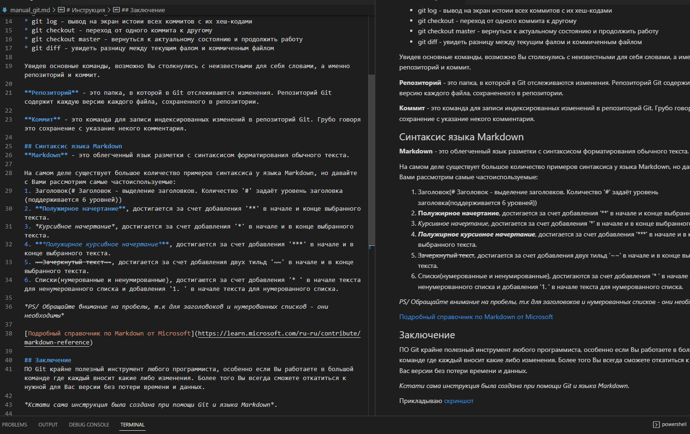

# Инструкция
Доброго времени суток! Сегодня мы с Вами рассмотрим Git.

## Что же такое Git?

**Git** - это программное обеспечение для облегчения работы с изменяющейся информацией. Система управления версиями позволяет хранить несколько версий одного и того же документа, при необходимости возвращаться к более ранним версиям, определять, кто и когда сделал то или иное изменение, и многое другое.

## Основные команды
Существует большое количество команд Git, но я хотел бы рассмотреть самые основные:
* git init - инициализация локального репозитория
* git status - получить информацию от git о его текущем состоянии
* git add - добавить файл или файлы к следующему коммиту
* git commit -m "message" - создание коммита
* git log - вывод на экран истоии всех коммитов с их хеш-кодами
* git checkout - переход от одного коммита к другому
* git checkout master - вернуться к актуальному состоянию и продолжить работу
* git diff - увидеть разницу между текущим фалом и коммиченным файлом

Увидев основные команды, возможно Вы столкнулись с неизвестными для себя словами, а именно репозиторий и коммит.

**Репозиторий** - это папка, в которой в Git отслеживаются изменения. Репозиторий Git содержит каждую версию каждого файла, сохраненного в репозитории.

**Коммит** - это команда для записи индексированных изменений в репозиторий Git. Грубо говоря это сохранение с указание некого комментария.

## Синтаксис языка Markdown
**Markdown** - это облегченный язык разметки с синтаксисом форматирования обычного текста.

На самом деле существует большое количество примеров синтаксиса у языка Markdown, но давайте с Вами рассмотрим самые частоиспользуемые:
1. Заголовок(# Заголовок - выделение заголовков. Количество '#' задаёт уровень заголовка(поддерживается 6 уровней))
2. **Полужирное начертание**, достигается за счет добавления '**' в начале и конце выбранного текста.
3. *Курсивное начертание*, достигается за счет добавления '*' в начале и в конце выбранного текста.
4. ***Полужирное курсивное начертание***, достигается за счет добавления '***' в начале и в конце выбранного текста.
5. ~~Зачеркнутый текст~~, достигается за счет добавления двух тильд '~~' в начале и в конце выбранного текста.
6. Списки(нумерованные и ненумированные), достигаются за счет добавления '* ' в начале текста для ненумерованного списка и добавления '1. ' в начале текста для нумерованного списка.

*PS/ Обращайте внимание на пробелы, т.к для заголовоков и нумерованных списков - они необходимы*

[Подробный справочник по Markdown от Microsoft](https://learn.microsoft.com/ru-ru/contribute/markdown-reference)

## Заключение
ПО Git крайне полезный инструмент любого программиста, особенно если Вы работаете в большой команде где каждый вносит какие либо изменения. Более того Вы всегда сможете откатиться к нужной для Вас версии без потери времени и данных. 

*Кстати сама инструкция была создана при помощи Git и языка Markdown*. 

Прикладываю скриншот:
 

На этом все)

Спасибо за время уделенное на ознакомление с инструкцией, надеюсь она Вам помогла😉😉😉
